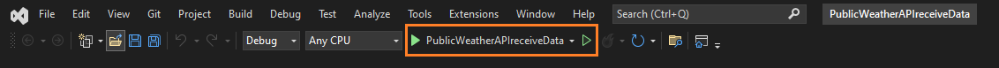
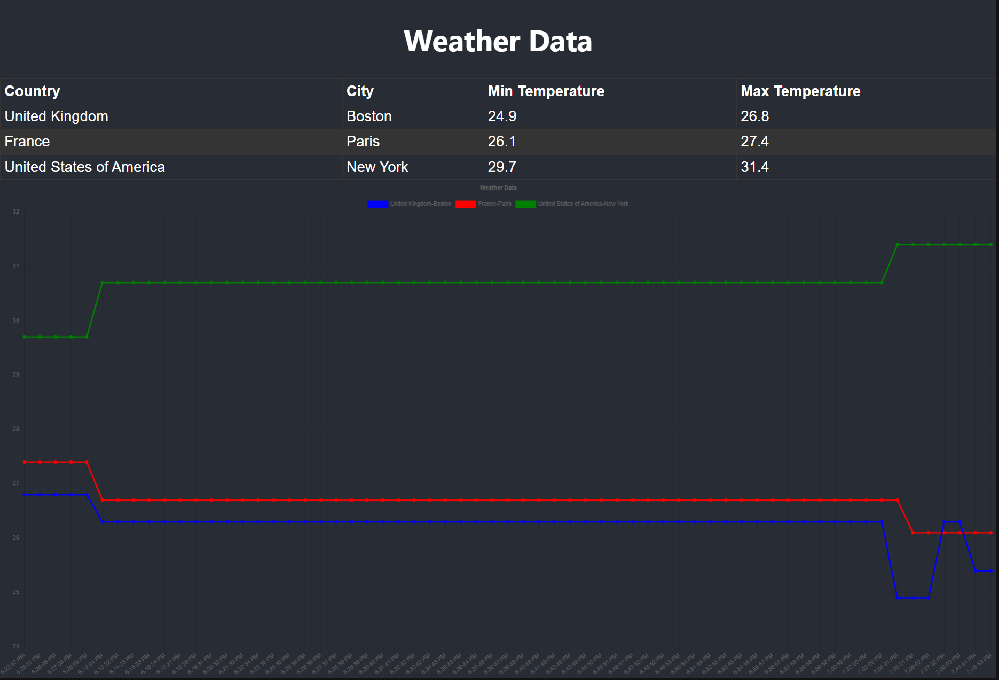

# PublicWeatherAPIreceiveData

An ASP.NET Core Web MVC .NET 6 application which:

- uses public weather API to receive data (country, city, temperature) from 3 cities in 3 countries - with periodical update 1/min.
- stores this data in the database and shows in graphs (Lines): Min and Max temperature (Country\City\Temperature\Last update time).
- uses build React as frotend.

Before you start:

- Register `https://rapidapi.com/weatherapi/api/weatherapi-com/playground` and get your `api key`
  - :exclamation: or modify WeatherApiService for your needs.
- Go to `PublicWeatherAPIreceiveData\PublicWeatherAPIreceiveData.Services\Services\WeatherApiService.cs`
  - Add your api key to `x-rapidapi-key` inside `GetWeatherDataAsync` method.
- Go to `PublicWeatherAPIreceiveData\PublicWeatherAPIreceiveData\wwwroot\react-app\`
  - open `powershell` or `cmd` and type:
    - `npm install`
    - `npm run build`

1. Open and run project with capable IDE of your choice. I used Visual Studio in example below.

- If web browser does not open automatically, go to:
  - 'https://localhost:7090' React frotend
  - 'https://localhost:7090/weather' -> WeatherData
  - 'https://localhost:7090/weather/min-max-temperatures' -> Min Max temperatures

2. Visual Studio should open browser window automaticaly with project page or go
   [https://localhost:7090](https://localhost:7090)

## If you have trouble launching project. See information below.

## :exclamation::exclamation::exclamation: Download and install :exclamation::exclamation::exclamation:

Microsoft SQL Server Management Studio (OPTIONAL) 
https://learn.microsoft.com/en-us/sql/ssms/download-sql-server-management-studio-ssms?view=sql-server-ver16

Visualstudio (with the ASP.NET and web development workload)  
https://visualstudio.microsoft.com/vs/

SQL Server  
https://www.microsoft.com/en-us/sql-server/sql-server-downloads

Node Js Latest LTS Version 
https://nodejs.org/en/download/

.NET 6.0  
https://dotnet.microsoft.com/en-us/download

More Info:

- [https://www.chartjs.org/](https://www.chartjs.org/)
- [https://react.dev/](https://react.dev/)
- [https://code.visualstudio.com/](https://code.visualstudio.com/) -> optional if you need edit `react-app`

### To run your program:

If you are new to .NET visit [microsoft.com](https://dotnet.microsoft.com/en-us/learn)

1. You need to clone or download project from GitHub [project page](https://github.com/kristaps-m/PublicWeatherAPIreceiveData)
2. You need the .NET Framework and an IDE (integrated development environment) to work with the C# language. [Try this page to get started.](https://www.simplilearn.com/c-sharp-programming-for-beginners-article)

- :exclamation::exclamation::exclamation: You will need data to work with :exclamation::exclamation::exclamation:
- :exclamation: In Visual Studio, Start project and wait data to be collected.
- now you should see data in your Microsoft SQL Server Management Studio
- more information [learn.microsoft.com](https://learn.microsoft.com/en-us/ef/core/cli/powershell)

### Improvements in future:

- [ ] improve Front End UI and visuals.
- [ ] add endpoint for ChartJS.
- [ ] create Front End using other frameworks.
